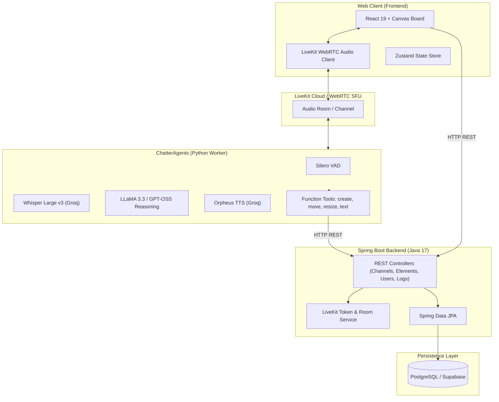

# ChatterBoxAI 🎙️⚡🎨

> **Next-Generation Real-Time Collaborative Canvas Driven by Autonomous Voice AI Teammates**

[](https://react.dev/)
[](https://vitejs.dev/)
[](https://spring.io/projects/spring-boot)
[](https://www.python.org/)
[](https://livekit.io/)
[](https://tailwindcss.com/)
[](https://www.postgresql.org/)

---

## 🌟 Overview

**ChatterBox AI** revolutionizes team whiteboarding and brainstorming by connecting multi-user LiveKit audio rooms directly to an autonomous, multimodal AI teammate. 

Instead of manually clicking through toolbars or taking notes during meetings, simply speak naturally. ChatterBox AI listens, understands spatial and semantic context, executes canvas actions (drawing shapes, repositioning elements, writing notes, formatting text), and talks back in real time with human-like voice synthesis.

---

## ✨ Key Features

- 🎙️ **Live Voice Directives**: Zero-click canvas manipulation powered by low-latency Speech-to-Text (Whisper Large v3 on Groq) and Silero Voice Activity Detection (VAD).
- 🤖 **Autonomous AI Teammate**: Participates as an intelligent colleague in group calls. It acknowledges commands, resolves relative positions (e.g., *"draw a box to the right of the note"*), and speaks back using neural TTS (Canopy Labs Orpheus).
- 🎨 **Infinite Shared Canvas**: Interactive vector whiteboard with support for custom shapes (rectangles, diamonds, ellipses, cards), rich text, sticky notes, dragging, resizing, and canvas image export.
- 👥 **Multi-User Collaboration & Channels**: Dedicated channel workspaces, user guest sessions, member lists, and WebRTC spatial audio presence with live speaking indicators.
- 📜 **Full Conversation & Audit Logs**: Real-time voice transcription and action recording saved into the database for retrospective search and review.

---

## 🏛️ System Architecture



---

## 📁 Repository Structure

```
ChatterBoxAI/
├── .gitignore                     # Global gitignore (credentials, builds, venv, caches)
├── README.md                      # Comprehensive project documentation
│
├── Frontend/                      # React 19 + Vite Frontend
│   ├── src/
│   │   ├── components/
│   │   │   ├── canvas/            # Canvas board, toolbar, shape & text renderers
│   │   │   ├── voice/             # Room connector, voice control bar, logs, status
│   │   │   └── workspace/         # Channels, modals, user list, sidebars
│   │   ├── pages/                 # LandingPage, Workspace
│   │   ├── store/                 # Zustand state stores (canvas, channel, user, voice)
│   │   └── lib/                   # API clients & endpoint definitions
│   ├── package.json
│   └── vite.config.js
│
├── Backend/                       # Spring Boot 4.x Backend
│   └── demo/
│       ├── pom.xml                # Maven configuration (LiveKit SDK, JPA, Postgres)
│       └── src/main/
│           ├── java/com/ChatterBox/demo/
│           │   ├── Config/        # CORS & RestTemplate configuration
│           │   ├── Controller/    # Channel, Element, User, Conversation REST APIs
│           │   ├── Entity/        # JPA Entities (User, Channel, Elements, Conversation)
│           │   ├── Repository/    # Spring Data JPA repositories
│           │   └── Services/      # Business logic & LiveKit token service
│           └── resources/
│               ├── application.properties.example  # Configuration template
│               └── application.properties          # Local secrets (ignored by git)
│
└── ChatterAgents/                 # LiveKit AI Agent Worker
    └── AI-Agent-Worker/
        ├── agent.py               # LiveKit Agent Worker & Canvas Function Tools
        ├── chatter.py             # Groq LLaMA chat completion helper
        ├── server.py              # Auxiliary FastAPI endpoint
        ├── requirements.txt       # Python dependencies
        ├── .env.example           # Environment variable template
        └── .env                   # Local API keys (ignored by git)
```

---

## 🛠️ Tech Stack

| Layer | Technologies |
|---|---|
| **Frontend** | React 19, Vite, TailwindCSS 4, Zustand, `@livekit/components-react`, Lucide React, OGL (WebGL) |
| **Backend** | Java 17, Spring Boot 4, Spring Data JPA, LiveKit Server SDK, PostgreSQL (Supabase) |
| **AI Agent Worker** | Python 3.10+, `livekit-agents`, Groq API (Whisper-large-v3, LLaMA 3.3 70B, Orpheus TTS), Silero VAD |
| **Real-Time Infra** | LiveKit Cloud WebRTC SFU |

---

## 🚀 Getting Started

### Prerequisites

Ensure you have installed:
- **Node.js**: v18+ (Node 20 recommended) & npm
- **Java**: JDK 17 or higher
- **Maven**: 3.8+ (or use the included `./mvnw`)
- **Python**: 3.10+ & `pip`
- **PostgreSQL Database**: Local or Cloud (e.g. Supabase, AWS RDS)
- **LiveKit Cloud Project**: Credentials from [cloud.livekit.io](https://cloud.livekit.io)
- **Groq Cloud API Key**: From [console.groq.com](https://console.groq.com)

---

### 1. Configure Secrets & Environments

> [!IMPORTANT]
> Never commit `.env` or `application.properties` files. Both are protected by `.gitignore`. Templates are provided below.

#### A. Backend Configuration
Copy the template in `Backend/demo/src/main/resources/`:
```bash
cp Backend/demo/src/main/resources/application.properties.example Backend/demo/src/main/resources/application.properties
```
Edit `Backend/demo/src/main/resources/application.properties`:
```properties
spring.application.name=demo
livekit.api.key=YOUR_LIVEKIT_API_KEY
livekit.api.secret=YOUR_LIVEKIT_API_SECRET
livekit.api.url=wss://your-livekit-project.livekit.cloud

spring.datasource.url=jdbc:postgresql://your-host:5432/postgres?prepareThreshold=0
spring.datasource.username=your_db_username
spring.datasource.password=your_db_password
spring.jpa.hibernate.ddl-auto=update
spring.jpa.show-sql=true
```

#### B. AI Agent Worker Configuration
Copy the template in `ChatterAgents/AI-Agent-Worker/`:
```bash
cp ChatterAgents/AI-Agent-Worker/.env.example ChatterAgents/AI-Agent-Worker/.env
```
Edit `ChatterAgents/AI-Agent-Worker/.env`:
```env
OPENAI_API_KEY=gsk_your_groq_api_key_here
LIVEKIT_API_KEY=your_livekit_api_key
LIVEKIT_API_SECRET=your_livekit_api_secret
LIVEKIT_URL=wss://your-livekit-project.livekit.cloud
```

---

### 2. Run the Backend

```bash
cd Backend/demo
./mvnw spring-boot:run
```
*The Spring Boot server will start on `http://localhost:8080`.*

---

### 3. Run the AI Agent Worker

Open a new terminal:
```bash
cd ChatterAgents/AI-Agent-Worker

# Create and activate virtual environment
python -m venv venv
# On Windows:
.\venv\Scripts\activate
# On macOS/Linux:
# source venv/bin/activate

# Install dependencies
pip install -r requirements.txt

# Run the agent in development mode
python agent.py dev
```
*The agent will connect to your LiveKit room automatically whenever a user joins a voice channel.*

---

### 4. Run the Frontend

Open a third terminal:
```bash
cd Frontend

# Install dependencies
npm install

# Start Vite development server
npm run dev
```
*Navigate to `http://localhost:5173` in your browser.*

---

## 🗣️ Voice Commands for the AI Teammate

Once you enter a channel and unmute your microphone, address the agent naturally:

| Command Intent | Example Spoken Utterance |
|---|---|
| **Create Elements** | *"Hey agent, draw a rectangle at coordinates 300, 200"* |
| **Relative Placement** | *"Place a sticky note next to the blue circle"* |
| **Resize Shapes** | *"Resize element 4 to width 250 and height 150"* |
| **Reposition** | *"Move the welcome card down to 500 on Y"* |
| **Add Text** | *"Write 'System Architecture' at 100, 100"* |
| **Format Text** | *"Format text element 2 with font Inter, size 24, and color #38bdf8"* |
| **Delete Elements** | *"Delete element 5 from the canvas"* |
| **Inquiries** | *"What time is it?"* or *"What elements are currently on our board?"* |

---

## 📡 REST API Summary

| Method | Endpoint | Description |
|---|---|---|
| `POST` | `/register` | Register a new user session / guest |
| `GET` | `/getAllChannels` | List all existing workspaces |
| `POST` | `/createChannel` | Create a new channel & room |
| `POST` | `/joinChannel` | Join channel & get LiveKit JWT token |
| `GET` | `/getAllElementsByChannel` | Retrieve canvas elements for channel |
| `POST` | `/createElement` | Add shape element to canvas |
| `POST` | `/updateElement` | Update position/shape attributes |
| `POST` | `/moveElement` | Move element coordinates |
| `POST` | `/resizeElement` | Resize element dimensions |
| `POST` | `/createText` | Create text block on canvas |
| `POST` | `/formatText` | Update font, color, and size of text |
| `DELETE` | `/deleteElement` | Remove element by ID |
| `POST` | `/saveConversation` | Persist voice transcription / dialog |
| `GET` | `/getAllConversations` | Retrieve conversation history |

---

## 🔒 Security Best Practices

1. **Credentials Isolation**: All sensitive credentials (`.env`, `application.properties`) are excluded from version control via `.gitignore`.
2. **WebRTC Tokens**: LiveKit tokens are securely generated on the backend using the LiveKit Java Server SDK and passed to the frontend on channel join.
3. **CORS Configuration**: CORS policies are centralized in `CorsConfig.java`.

---

## 🤝 Contributing

Contributions, issues, and feature requests are welcome!
1. Fork the Project
2. Create your Feature Branch (`git checkout -b feature/AmazingFeature`)
3. Commit your Changes (`git commit -m 'Add some AmazingFeature'`)
4. Push to the Branch (`git push origin feature/AmazingFeature`)
5. Open a Pull Request

---

## 📄 License

Distributed under the MIT License. See `LICENSE` for more information.
